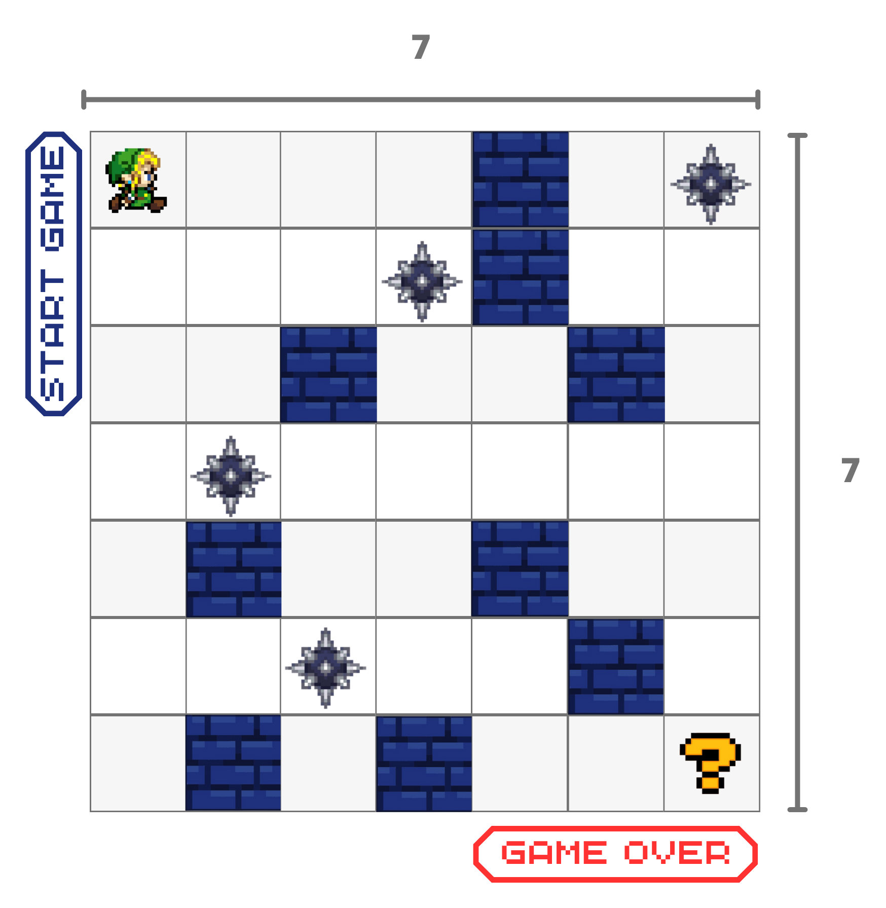
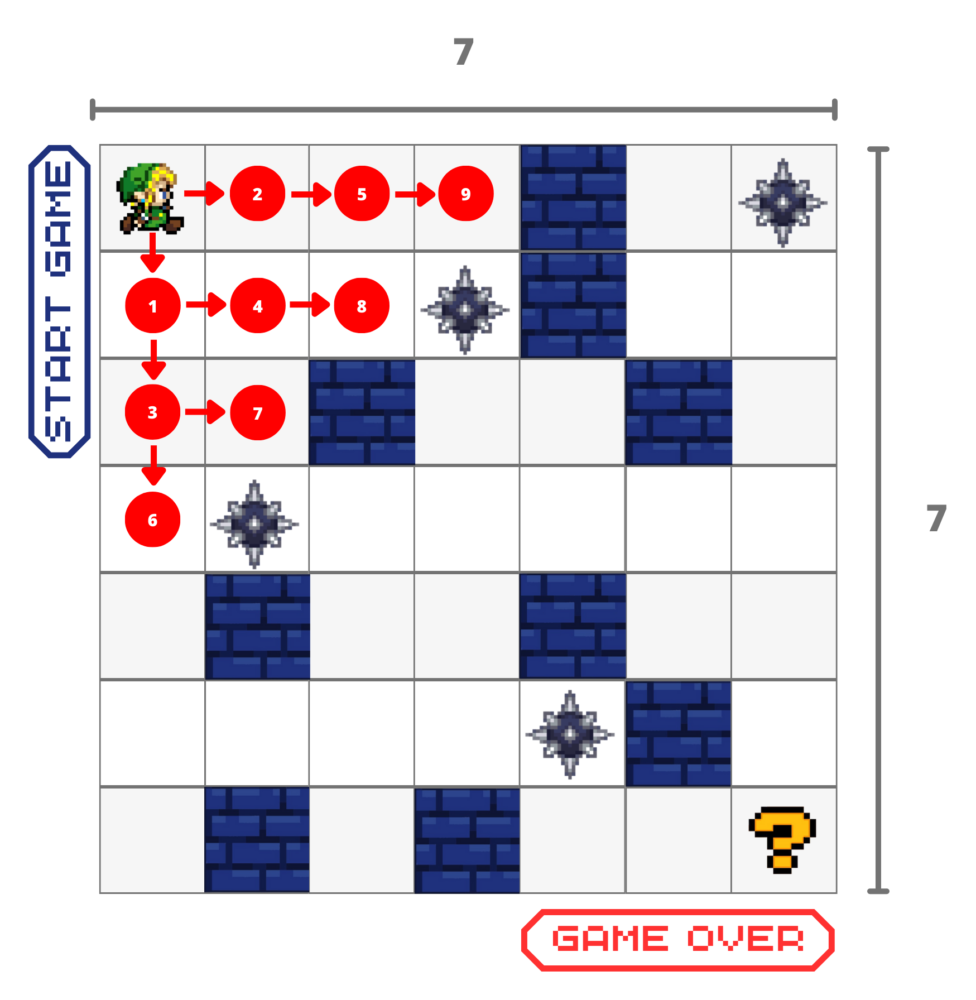
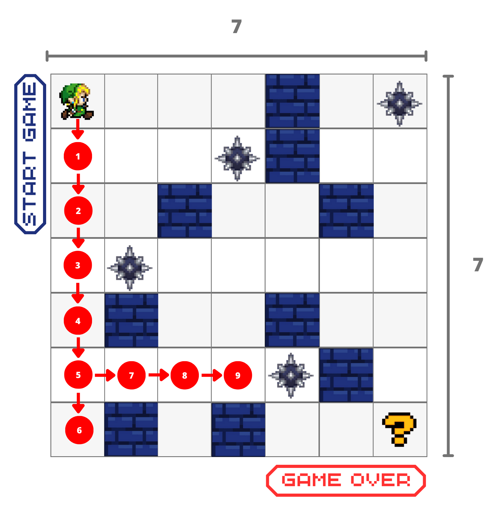
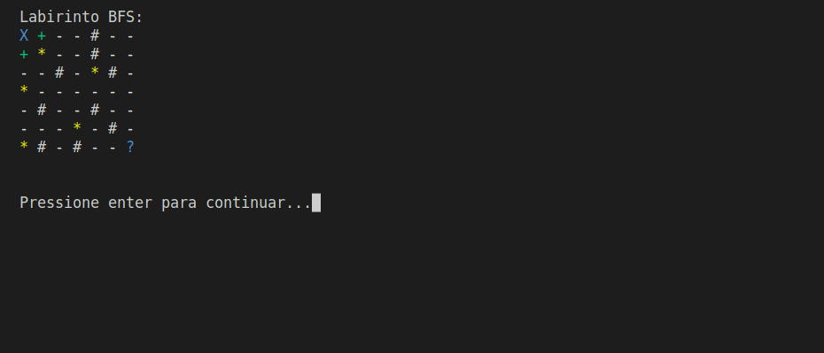
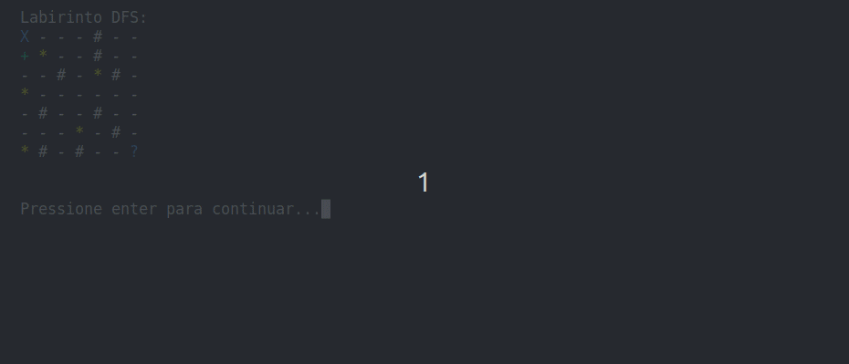
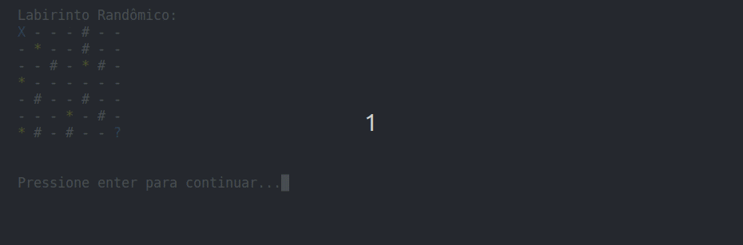
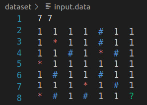

# 
<div style="display: inline_block">
  
  
  
</div><br/>

# Apresentação do Problema
<div align="justify">

O Problema em análise consiste na implementação de três modelos de caminhamento em uma matriz labirinto. 
	
Os modelos de caminhamento são: **Randômico** (já realizado e precisa ser adaptado), em **Largura (BFS)** e em **Profundidade (DFS)**;
	
A matriz tem tamanho N x N e contém quatro tipos de elementos: 
	
- <code>('1')</code>: **Passagem livre**; 
- <code>('*')</code>: **Item de dano**; 
- <code>('#')</code>: **Paredes**;
- <code>('?')</code>: **Ponto de parada** --> colocado **aleatoriamente** na matriz;

</div>

<p align="center">
 
</p>
<p align="center">
<em>Imagem 1: Imagem esquemática do labirinto.</em>
</p>

<div align="justify">
	
O objetivo é percorrer toda a matriz a partir do ponto de partida até o ponto de parada, evitando as paredes e os itens de dano;
	
Se o algoritmo **encontrar um item de dano ('*')**, ele **deve retornar ao ponto de partida** e **reiniciar o caminhamento**, **demarcando o item de passagem livre (1) na posição do dano**;
	
Isso adiciona um custo adicional ao processo e permite avaliar a composição da entrada, o modelo de execução e o comportamento do algoritmo;
		
A matriz deve ser grande, com tamanho em torno de 50 x 50 ou maior, para permitir testes mais abrangentes;
	
O objetivo final é avaliar a implementação e o desempenho dos modelos de caminhamento em relação aos desafios impostos pela matriz labirinto.

</div>

# O que é BFS?
<div align="justify">
	
**Breadth-First Search (BFS)** ou **Busca em Largura**, é um algoritmo de busca em grafo que começa a explorar a partir do vértice raiz e visita todos os seus vizinhos primeiro, antes de se mover para o próximo nível de vizinhos. Em outras palavras, ele explora todos os vértices a uma distância "d" antes de explorar qualquer vértice a uma distância "d+1".
	
É um método para percorrer todos os vértices de um grafo, visitando todos os vértices a uma determinada distância antes de passar para o próximo nível de distância. Ele começa a partir de um vértice inicial (também chamado de raiz) e explora todos os vértices que estão a uma distância de um passo da raiz antes de passar para os vértices que estão a uma distância de dois passos da raiz, e assim por diante.
	
<p align="center">
 
</p>
<p align="center">
<em>Imagem 2: Busca em Largura.</em>
</p>
	
</div>


# O que é DFS?
<div align="justify">
	
**Depth-First Search (DFS)** ou **Busca em Profundidade**, é um algoritmo de busca em grafo que começa a explorar a partir do vértice raiz e visita um caminho o mais profundo possível antes de retroceder. Em outras palavras, ele explora um ramo inteiro do grafo antes de voltar e explorar outro ramo.

É um método para percorrer todos os vértices de um grafo, visitando um caminho o mais profundo possível antes de retroceder. Ele começa a partir de um vértice inicial (também chamado de raiz) e explora todo o caminho para baixo até chegar a um vértice sem filhos ou a um vértice que já foi visitado. Em seguida, ele retrocede e explora o próximo caminho não visitado até que todos os vértices do grafo tenham sido visitados.
	
Uma das principais diferenças entre o algoritmo **DFS** e o algoritmo **BFS** é que o **DFS** explora um ramo inteiro do grafo antes de retroceder e visitar outro ramo, enquanto o BFS explora todos os vértices a uma determinada distância do vértice inicial antes de passar para o próximo nível de distância.
	
</div>

<p align="center">
 
</p>
<p align="center">
<em>Imagem 3: Busca em Profundidade.</em>
</p>

## Solução do Problema

<div align="justify">

Em resumo, os três tipos de labirintos apresentam abordagens diferentes para a criação e resolução de labirintos que permitem movimentos nas direções **DIREITA**, **ESQUERDA**, **CIMA** e **BAIXO**.

Esses três tipos de labirintos oferecem experiências diferentes para o jogador. O labirinto **Randômico** proporciona uma sensação de descoberta e desafio, o labirinto **BFS** oferece uma busca otimizada pelo destino e o labirinto **DFS** cria um senso de exploração e pode levar a soluções não tão eficientes. Cada um desses labirintos tem suas próprias características e desafios, proporcionando diferentes experiências aos jogadores. Abaixo esses modelos serão melhor detalhados.

</div>


## Randômico

<div align="justify">

O código implementado é basicamente o mesmo implementado no trabalho [Labirinto-Recorrente](https://github.com/phpdias/labirinto-recorrente), um algoritmo para gerar e resolver um labirinto aleatório, com algumas adaptações. A função <code>aleatoria</code> gera um labirinto aleatório e a função <code>checkMovimento</code> verifica se um determinado movimento é válido. A lógica principal está em um loop que continua até o jogador alcançar o destino no labirinto. Durante o loop, são feitos movimentos aleatórios e as posições são atualizadas de acordo. Se o jogador encontra um inimigo, o inimigo é removido e o jogador retorna à posição inicial. A quantidade de movimentos é registrada e, ao final, é exibida uma mensagem indicando se o jogador alcançou o destino ou não.
	
</div>

## BFS

```Solução do Problema```

O BFS explora os vértices de um grafo em camadas, começando pelo vértice inicial e expandindo para os vizinhos antes de explorar vértices mais distantes. Ou seja, a medida que o algoritmo avança, ele explora todas as células vizinhas de uma célula antes de avançar para as células mais distantes. Dessa forma, o BFS garante que encontraremos o caminho mais curto entre a célula inicial e qualquer outra célula no labirinto.

Durante a execução do BFS, podemos armazenar informações adicionais, como o caminho percorrido, para posterior análise ou uso. Isso pode ser feito mantendo uma estrutura de dados adicional, como um vetor de predecessores, que registra de qual célula cada célula foi alcançada.

Ao final do algoritmo, podemos determinar se a célula de saída do labirinto foi alcançada ou não. Além disso, se armazenamos o caminho percorrido, podemos recuperar o caminho mais curto entre a célula. 
	
Abaixo está um exemplo de como resolver o problema do BFS:

1º) Inicialização:

- Escolha um vértice inicial para começar a busca.
- Crie uma fila vazia e marque o vértice inicial como visitado.
- Insira o vértice inicial na fila.

2º) Iteração:

- Enquanto a fila não estiver vazia, repita os seguintes passos:
	- Remova o vértice da frente da fila.
	- Explore todos os vértices vizinhos não visitados do vértice removido.
		- Marque cada vértice vizinho como visitado.
		- Insira cada vértice vizinho na fila.
		- Realize as ações desejadas para cada vértice (por exemplo, armazenar o caminho percorrido, calcular distâncias, etc.).

3º) Condição de Parada:

- O BFS termina quando a fila estiver vazia, ou seja, todos os vértices alcançáveis foram visitados.

<p align="center">
 
</p>

<p align="center">
<em>Gif 1: Exemplo do labirinto BFS executando.</em>
</p>

## DFS

```Solução do Problema```

Durante a execução do DFS, o algoritmo segue um caminho até alcançar um vértice terminal, ou seja, um vértice que não possui vértices vizinhos não visitados. Quando isso ocorre, o algoritmo retorna ao vértice anterior e continua a explorar os vértices restantes.

O DFS percorre o grafo em profundidade antes de retroceder, o que significa que ele explora um ramo inteiro até atingir um vértice terminal antes de explorar outros ramos. Além disso, durante a execução do algoritmo, podemos armazenar informações adicionais, como o caminho percorrido, para posterior análise ou uso. Isso pode ser feito mantendo uma estrutura de dados adicional, como um vetor de predecessores, que registra de qual vértice cada vértice foi alcançado.

Ao final do algoritmo, podemos determinar se um determinado vértice foi alcançado ou não. Além disso, se armazenamos o caminho percorrido, podemos recuperar o caminho completo entre o vértice inicial e um vértice específico.

Abaixo está um exemplo de como resolver o problema do DFS:

1º) Inicialização:

- Escolha um vértice inicial para começar a busca.
- Crie uma pilha vazia para armazenar os vértices a serem explorados.
- Marque o vértice inicial como visitado.
- Insira o vértice inicial na pilha.

2º) Iteração:

- Enquanto a pilha não estiver vazia, repita os seguintes passos:
	- Remova o vértice do topo da pilha.
	- Explore todos os vértices vizinhos não visitados do vértice removido.
		- Para cada vértice vizinho:
			- Marque o vértice vizinho como visitado.
			- Insira o vértice vizinho na pilha.
		- Realize as ações desejadas para cada vértice, como armazenar o caminho percorrido ou calcular distâncias.

3º) Condição de Parada:

- O DFS termina quando a pilha estiver vazia, ou seja, todos os vértices alcançáveis foram visitados.


<p align="center">
 
</p>

<p align="center">
<em>Gif 2: Exemplo do labirinto DFS executando.</em>
</p>

## Random

```Solução do Problema```

O termo "Random" não se refere a um algoritmo específico, mas sim a um conceito geral de seleção aleatória. A seleção aleatória é amplamente utilizada em algoritmos e estruturas de dados para diferentes finalidades, como embaralhar elementos, gerar números aleatórios, amostragem aleatória e muito mais. Portanto, não há uma solução específica para o problema "Random".

Abaixo está um exemplo de como resolver o problema Randômico:

1º) Inicialização:

- Dado um conjunto de elementos a serem embaralhados, como uma lista.
- Definir o índice inicial como o último elemento da lista.

2º) Iteração:

- Enquanto o índice for maior que zero, repetir os seguintes passos:
- Gerar um número aleatório entre zero e o índice atual.
- Trocar o elemento na posição do índice atual com o elemento na posição do número aleatório gerado.
- Diminuir o valor do índice em um.

3º) Condição de Parada:

- O algoritmo termina quando o índice chega a zero, ou seja, todos os elementos foram embaralhados.

Durante a execução do exemplo acima, cada elemento é trocado de posição com um elemento aleatório que está antes dele na lista. Essa troca aleatória garante que todos os elementos tenham a mesma chance de ocupar qualquer posição na lista, resultando em um embaralhamento justo e aleatório.

Em resumo, a solução do problema "Random" pode variar dependendo do contexto e do objetivo desejado. O uso de algoritmos específicos para seleção aleatória ou geração de números aleatórios é comum para lidar com a aleatoriedade em algoritmos e estruturas de dados.

<p align="center">
 
</p>

<p align="center">
<em>Gif 3: Exemplo do labirinto randômico executando.</em>
</p>


# Experimentação

<div align="justify">
	
Nesta seção, apresentamos os resultados de experimentos envolvendo três tipos de algoritmos de busca: **Randômico**, **BFS** e **DFS**. O objetivo dos experimentos é comparar o desempenho e a eficácia desses algoritmos em um mesmo tipo de entrada, utilizando uma máquina com especificações definidas.

Os experimentos foram conduzidos em uma máquina com as seguintes especificações:

- Processador: Ryzen 5 5500;
- Memória RAM: 8 GB DDR4;
- Sistema Operacional: Ubuntu Linux;
- Linguagem de Programação: C++.

Para cada algoritmo (**Randômico**, **BFS** e **DFS**), foram executadas 10 iterações utilizando a mesma entrada [<code>inputa.data</code>](https://github.com/celzin/RAND_BFS_DFS/blob/main/imgs/input.data). A entrada consiste em um labirinto representado por uma matriz 50x50, no qual estão presentes os 4 tipos elementos apresentados anteriormente('1', '*', '#', '?'). Essa entrada foi mantida constante em todos os experimentos para garantir a comparabilidade dos resultados. Durante cada iteração, o tempo de execução do algoritmo, o caminho percorrido e a solução encontrada (caso tenha sido encontrada) foram registrados. Os resultados obtidos nos experimentos foram analisados com auxílio da tabela abaixo.

</div>

<table align="center">
  <tr>
    <th align="center">Medições</th>
    <th align="center">Random (tempo em segundos)</th>
    <th align="center">BFS (tempo em segundos)</th>
    <th align="center">DFS (tempo em segundos)</th>
  </tr>
  <tr>
    <td align="center">1</td>
    <td align="center">66.92</td>
    <td align="center">79.45</td>
    <td align="center">0.94</td>
  </tr>
  <tr>
    <td align="center">2</td>
    <td align="center">79.45</td>
    <td align="center">16.79</td>
    <td align="center">1.30</td>
  </tr>
  <tr>
    <td align="center">3</td>
    <td align="center">80.70</td>
    <td align="center">17.74</td>
    <td align="center">0.86</td>
  </tr>
  <tr>
    <td align="center">4</td>
    <td align="center">75.85</td>
    <td align="center">16.59</td>
    <td align="center">0.85</td>
  </tr>
  <tr>
    <td align="center">5</td>
    <td align="center">63.59</td>
    <td align="center">16.33</td>
    <td align="center">0.83</td>
  </tr>
  <tr>
    <td align="center">6</td>
    <td align="center">62.41</td>
    <td align="center">16.18</td>
    <td align="center">0.86</td>
  </tr>
  <tr>
    <td align="center">7</td>
    <td align="center">65.44</td>
    <td align="center">16.57</td>
    <td align="center">0.87</td>
  </tr>
  <tr>
    <td align="center">8</td>
    <td align="center">88.21</td>
    <td align="center">16.92</td>
    <td align="center">0.86</td>
  </tr>
  <tr>
    <td align="center">9</td>
    <td align="center">78.54</td>
    <td align="center">16.49</td>
    <td align="center">0.86</td>
  </tr>
  <tr>
    <td align="center">10</td>
    <td align="center">80.60</td>
    <td align="center">16.76</td>
    <td align="center">0.85</td>
  </tr>
  <tr>
    <td align="center">Média</td>
    <td align="center">74.17</td>
    <td align="center">16.75</td>
    <td align="center">0.91</td>
  </tr>
  <tr>
    <td align="center">Desvio Padrão</td>
    <td align="center">8.88</td>
    <td align="center">0.45</td>
    <td align="center">0.14</td>
  </tr>
</table>

<div align="justify">
	
Em resumo, com base nos dados fornecidos, podemos dizer que o algoritmo DFS apresentou o menor tempo médio de execução (0,91), seguido pelo algoritmo BFS (16,75) e, por fim, o algoritmo Random (74,17). Além disso, o algoritmo DFS apresentou a menor variabilidade nos tempos de execução, indicada pelo menor desvio padrão (0,14), enquanto o algoritmo Random apresentou a maior variabilidade, com um desvio padrão mais alto (8,88). Isso sugere que o algoritmo DFS pode ser mais consistente e previsível em termos de tempo de execução em comparação com os outros dois algoritmos no cenário da entrada fornecida.

</div>
	
# Conclusão

<div align="justify">

Partindo do contexto de um labirinto representado por uma matriz 50x50, buscamos analisar e comparar três modelos de busca: **Randômico**, **BFS** e **DFS**. Á frente exploramos as características de cada modelo em diferentes cenários, desde o melhor caso em que encontram soluções rapidamente, até o pior caso em que podem demorar ou até mesmo falhar em encontrar uma solução ótima. Além disso, abordaremos o caso médio, em que cada modelo se comporta de forma distintiva, a fim de compreender as características particulares para cada modelo.

</div>

### Melhor caso:
<div align="justify">

- **Randômico:** No melhor caso, o modelo Randômico pode encontrar o ponto de parada rapidamente se tiver sorte com suas escolhas aleatórias. No entanto, a probabilidade de encontrar uma solução ótima é baixa, pois não segue uma estratégia específica.
- **BFS:** É um algoritmo completo que procura a solução mais curta em termos de número de movimentos. No melhor caso, se o ponto de parada estiver próximo à posição inicial, o BFS encontrará uma solução ótima em um curto espaço de tempo.
- **DFS:** No melhor caso, se o ponto de parada estiver próximo à posição inicial e a busca seguir em uma direção favorável, o DFS pode encontrar uma solução rapidamente. No entanto, assim como o Randômico, não garante uma solução ótima.

</div>

### Pior caso:

<div align="justify">

- **Randômico:** No pior caso, o modelo Randômico pode ficar preso em um loop infinito ou levar um tempo muito longo para encontrar o ponto de parada, já que suas escolhas são aleatórias e não segue uma estratégia determinística.
- **BFS:** No pior caso, se o ponto de parada estiver localizado em uma área distante da posição inicial e houver muitas paredes no caminho, o BFS pode levar muito tempo para encontrar uma solução, pois explora todos os caminhos possíveis em largura.
- **DFS:** No pior caso, se o ponto de parada estiver localizado em uma área distante da posição inicial e a busca seguir em direções que levam a caminhos sem saída, o DFS pode se perder em profundidade e demorar para encontrar uma solução.

</div>

### Caso médio:

<div align="justify">

- **Randômico:** No caso médio, o modelo Randômico pode encontrar o ponto de parada em um tempo razoável, dependendo da distribuição dos elementos na matriz e da localização do ponto de parada. No entanto, a solução encontrada pode não ser ótima.
- **BFS:** No caso médio, o BFS tem uma boa chance de encontrar uma solução ótima ou próxima disso em um tempo razoável, explorando em largura e encontrando o caminho mais curto.
- **DFS:** No caso médio, o DFS pode encontrar o ponto de parada em um tempo razoável, mas a solução encontrada pode não ser a mais curta. O DFS é mais propenso a seguir caminhos mais profundos antes de retornar e explorar outras alternativas.

Em resumo, o modelo **Randômico** depende muito da sorte e não oferece garantias de encontrar uma solução ótima. O **BFS** é mais eficiente em encontrar soluções ótimas, enquanto o **DFS** pode ser mais rápido em alguns casos, mas não garante uma solução ótima. Dessa forma, compreender as particularidades e limitações de cada algoritmo é fundamental para tomar decisões informadas ao escolher a abordagem mais adequada para a busca em labirintos.

</div>

# Compilação e Execução 

<p align="justify">
Primeiramente, para o correto funcionamento do programa é necessário incluir um arquivo nomeado de <code>input.data</code> dentro da pasta <code>dataset</code>, devendo seguir o seguinte formato:
	
- Em sua primeira linha: os valores NxN que serão assumidos pelas matrizes geradas
- Logo em seguida, dispõe-se a matriz com os elementos espaçados, na seguinte ideia:

	- <code>('1')</code>: **Passagem livre**; 
	- <code>('*')</code>: **Item de dano**; 
	- <code>('#')</code>: **Paredes**;
	- <code>('?')</code>: **Ponto de parada**.
</p>

<p align="center">
 
</p>
<p align="center">
<em>Imagem 4: Exemplo de entrada no formato desejado.</em>
</p>

<p align="justify">
Por fim, esse programa possui um arquivo Makefile que realiza todo o procedimento de compilação e execução. Para tanto, temos as seguintes diretrizes de execução:
</p>

| Comando                |  Função                                                                                               |                     
| -----------------------| ------------------------------------------------------------------------------------------------------|
|  `make clean`          | Apaga a última compilação realizada contida na pasta build                                            |
|  `make`                | Executa a compilação do programa utilizando o gcc, e o resultado vai para a pasta build               |
|  `make run`            | Executa o programa da pasta build após a realização da compilação                                     |
	
## Contatos

| Participante           |  Contato                                                                                               |                     
| -----------------------| ------------------------------------------------------------------------------------------------------|
|  Celso                 | <a href="https://t.me/celso_vsf">                                       			       |
|  Pedro                 | <a href="https://t.me/phpdias">                                       			       |

</div>
